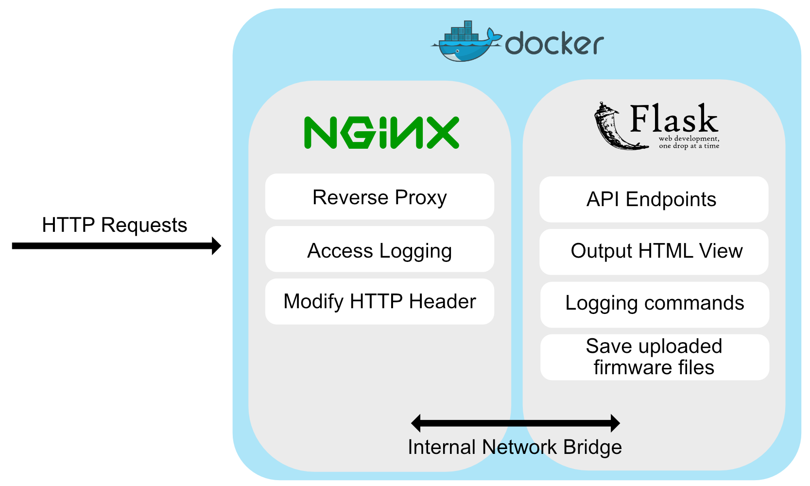

# Tasmopot (Tasmota Honeypot)

Tasmopot is a medium-interaction honeypot that simulates the most common Tasmota endpoints and the firmware update utility. All incoming HTTP requests and executed commands are logged. Tasmota-specific Server headers are set to ensure proper detection by e.g. Shodan. 

We provide a Docker compose file for containerized deployment. Additionally, there is a compose file for deployment within [T-Pot](https://github.com/telekom-security/tpotce).

## Authors

- [@ccclever2](https://www.github.com/ccclever2)
- [@sfdamm](https://www.github.com/sfdamm)


## Run via docker-compose (recommended)

Clone the project

```bash
  git clone https://link-to-project
```

Change to the project directory

```bash
  cd tasmopot
```

Start Docker container
```bash
  docker-compose up
```


## Run Locally (using Gunicorn, without nginx)
> **_Note:_** nginx is responsible for adding necessary Server header flags, these won't be set when using Gunicorn

Clone the project

```bash
  git clone https://link-to-project
```

Change to the app directory

```bash
  cd tasmopot/tasmopot-app
```

Install requirements
```bash
  pip install -r requirements.txt
```

Start Python App
```bash
  python app.py
```


## Tech Stack

**tasmopot-app:** Python, Flask, Gunicorn

**tasmopot-server:** nginx, nginx Headers More Plugin


## Architecture




## FAQ

#### Where are the logs located?

All recorded data can be found in the respective "/data" folder of the app and server. The `access.log` is associated with the nginx server. The logs of Tasmopot App are in the `logging` directory and separated in `commands` and `uploaded_files`


## Acknowledgements

This honeypot is the result of a bachelor thesis at the TU Berlin and has already received tasmota-specific hits in a first trial of 90 days and has been listed in numerous online public search tools such as Shodan.

## License

[MIT](https://choosealicense.com/licenses/mit/)

